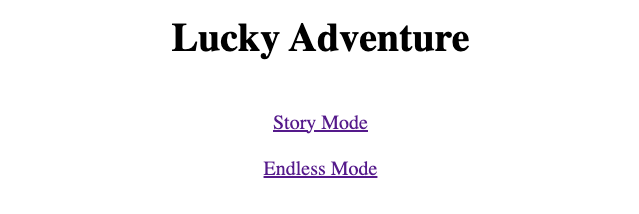
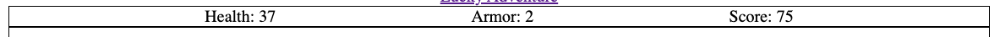
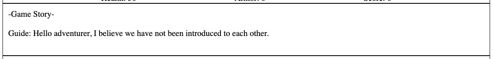
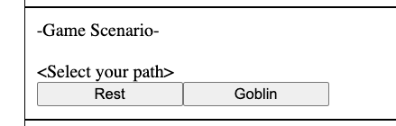
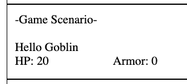
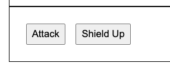
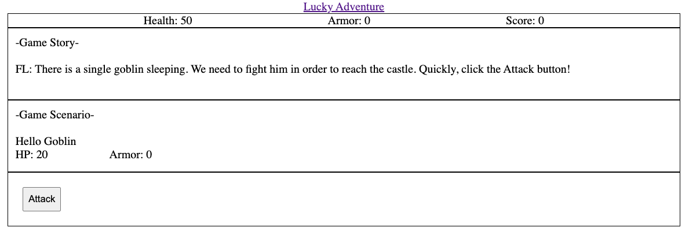
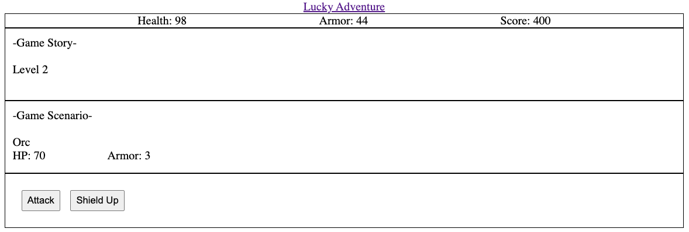
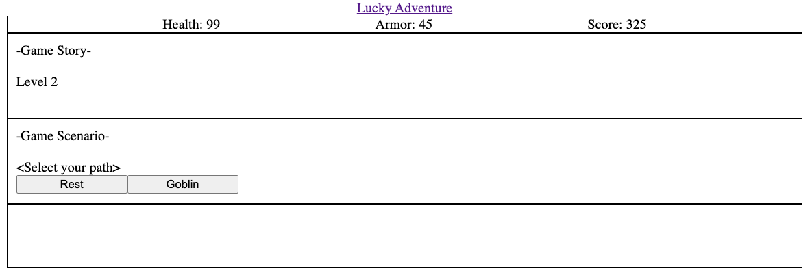

# lucky-adventure

## Description
Welcome to my first RPG game. Hope you enjoy it. (:

This is a simple rougelike rpg game where the goal is to get the highest score or highest level.

There are two modes in this game.
Story Mode & Endless Mode

You will face multiple randomly generated enemies and for each enemy defeated and floor cleared, you will get a score.

If you are in story mode, when you reach the end of story, you will face a Dark Lord which require correct planning and "luck" on your journey to have a chance to defeat it.

Once you are comfortable with the game gameplay, feel free to challenge the endless mode. This is the core game. Go get the highest score you can get. Or you can try to wiggle your way to reach the highest level in endless mode.

Good luck adventurer! You will need it.

---

## How to play
You can access the game [here](http://fl-lucky-adventure.surge.sh/).

The game will teach you how to play. You also have option to skip tutorial if you already play it before.

Summary of gameplay:

At the game title screen, you can select story mode or endless mode. It best to go through story mode once.    

The game is divided in 4 parts vertically.   
The top part contain your character status.    

The second part contain the story of the game and also providing your current floor level.   

The third part contain your current scenario. It include path selection and enemy info.   
 

The last part contain the battle option where you can select either to attack or buff up your defence.   

---

## Technology used

* HTML
* CSS
* JS

It just these 3 basics. You can clone it and you should have everything to run assuming your environment is setup to do web development.

---

## Trelo Board
[My Project Board](https://trello.com/b/dxFBUWY9/lucky-adventure)

---

## Game Screenshot

